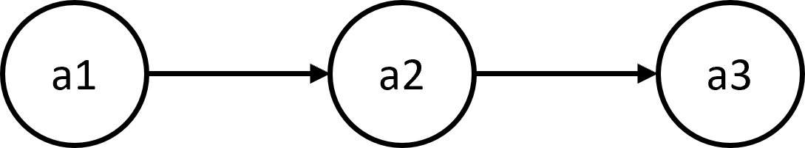
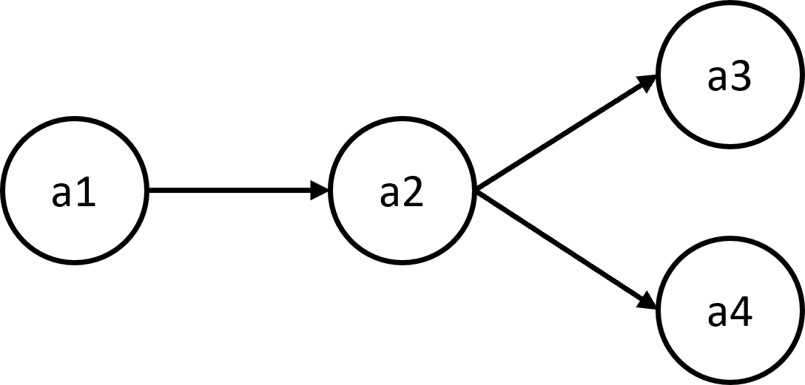

# COMP90054 AI Planning for Autonomy - Assignment 2 - Classical planning with PDDL

You must read fully and carefully the assignment specification and instructions detailed in this file. You are NOT to modify this file in any way.

* **Course:** [COMP90054 AI Planning for Autonomy](https://handbook.unimelb.edu.au/subjects/comp90054) @ Semester 1, 2022
* **Instructor:** Dr. Nir Lipovetzky and Prof. Tim Miller
* **Deadline:** Tuesday 12 April, 2022 @ 11:59pm
* **Course Weight:** 10%
* **Assignment type:** Individual
* **ILOs covered:** 1 and 2
* **Submission method:** via git (see Submission Instructions below for instructions)
* **Questions:** Ask on the discussion board, except if you need to discuss your own solution in detail
* **Extensions:** For extension applications, email Tim: <tmiller@unimelb.edu.au>

The **aim of this assignment** is to  improve your understanding and design of model-based planning problems. In the assignment, you will be asked to model a few small problems in the PDDL language and test your solution using a planning tool.

## Domain

The domain of the problem is an abstract secure network. Each agent represents a node in a network. A pair of agents can be connected via a communication channel.  Individual agents within a network share information that must be kept encrypted using shared keys. Provided that agents share a key and are connected via the network, they can send encrypted messages across a network, and only those agents within the network who have access to the shared key can decrypt it.

## Your tasks

You must submit your solution via Github without changing the names of any of the files.

* Please remember to complete the [STUDENT.md](STUDENT.md) file with your individual submission details (so we can identify you when it comes time to submit). Note that the format for this is different from assignment 1 -- please do not copy over the old file.

* You should **only work and modify** files  [secure_network.pddl](secure_network.pddl) and [secure_network_taskX_problem.pddl]. Any other files submitted will not be marked.

* Your models **must run _error-free_ on** [planning.domains](http://planning.domains). Staff will not debug/fix any code.

* To ensure anonymous grading, your PDDL files **must not have any personal information**, like your student number or your name. That info should go in the [STUDENT.md](STUDENT.md) file, as per instructions above. 

* **Assignment 2 FAQ** is available to answer common questions you might have about the Assignment 2 on ED at https://edstem.org/au/courses/8178/discussion/716339

* **Getting started on GitHub** - the video below explains how to **clone**, **git add**, **commit** and **push** while developing your solution for this assignment:

[](https://www.loom.com/share/ae7e93ab8bec40be96b638c49081e3d9)


### Task 1 [3 marks]

In the file [secure_network.pddl](secure_network.pddl), there is a skeleton file with types called `agent`, `information`, and `key` for you to use as the domain file. You may change these types, but you can solve the tasks without changing them.

In this first task, model the three following actions in the domain file:

1. `encrypt`: The `encrypt` action allows agents to encrypt information. It takes three parameters: (i) the agent encrypting the information; (ii) the information to be encrypted; and (iii) the shared key that is used to encrypt the information. The agent can only encrypt the information if it already has access to that  information in unencrypted form; and using a shared key that they have access to. The effect of the action is that the information is encrypted.

2. `decrypt`: The `decrypt` action allows agents to decrypt information. It takes three parameters: (i) the agent decrypting the information; (ii) the information to be decrypted; and (iii) the shared key that is used to decrypt the information. The agent can only decrypt the information if they have that information in encrypted form, which has been encrypted using the shared key they are trying to decrypt with. The effect of the action is that the agent now has access to the unencrypted information.

3. `share`: The `share` action allows agents to share encrypted information. It takes four parameters: (i) the agent sharing the information; (ii) the agent receiving the information; (iii) the encrypted information to be shared; and (iv) the shared key that the information was encrypted with. In reality, the key itself would not be shared across the network as this would defeat the purpose of encryption, however, including it as a parameter allows the planner to keep track of which key was used to encrypt information. An agent  can only share information with another agent if they are connected on the network; and if the sending agent has access to that information encrypted. The sending agent does not need to have the information in decrypted format -- it can share information encrypted by others.

The actual context of the information and keys are not important for the planning: the planner only needs to figure out the action sequence. As such, information and keys are just modelled as abstract objects.

**Important**: The action definitions must declare the parameters in the order that they are specified above.

**Marking criteria:**

- Actions parameters and precondition correctly model the behaviour [1 mark]
- Action effects correctly model the behaviour [1 mark]
- Model is readable and clear, and at a suitable level of abstraction [1 mark]

### Task 2 (1 mark)

In the problem file [secure_network_task2_problem.pddl](secure_network_task2_problem.pddl), modle a problem with three agents: `a1`, `a2`, and `a3`, one piece of information `i`, and one shared key `k`.

Model the secure network with the structure:

 <p align="center"> 
    
 </p>

Initially, only agent `a1` has access to the information `i` unencrypted. Agents `a1` and `a3` know the key `k`. Agent `a2` does not know the shared key.

The goal of problem is that agent `a3` must have the unencrypted information without agent `a2` having it.

**Marking criteria**: The problem file correctly models the structure and generates a correct plan [1 mark]

### Task 3 (1 marks)

In the problem file [secure_network_task3_problem.pddl](secure_network_task3_problem.pddl), model a problem with four agents: `a1`, `a2`, `a3`, and `a4`, two pieces of information `i1` and `i2`, and two shared keys `k1`, and `k2`.

Model the secure network with the structure:

 <p align="center"> 
    
 </p>

 Initially, only agent `a1` has access to the information `i1` unencrypted. Agent `a3` has access to the information `i2` unencrypted. Only agents `a1` and `a2` know the key `k1`; and only agents `a2`, `a3`, and `a4` have access to the key `k2`. 

The goal of problem is that agent `a4` must have the unenrypted information `i1` and `i2`. All other agents in the network are trusted so it is ok if they have `i1` and `i2` unencrypted, but they do not need to.

 **Marking criteria**: The problem file correctly models the structure and generates a correct plan [1 mark]

### Task 4 (2 marks)

Tasks 1-3 assume that the keys in the system are fixed; that is, there is no way to send keys around the network. In this task, we introduce the ability to send keys across a network. However, these keys must themselves be encrypted, or an observer or untrusted agent could access the keys.

For this, we will model a simple version of [public key cryptography](https://en.wikipedia.org/wiki/Public-key_cryptography).

In public key cryptography, each agent  has a  **public key** and a **private key**.  The public key is known by everyone. The private key is known only to the agent and is never shared. Due to some brilliant mathematics, a message encrypted with an agents' public key can only be decrypted by its private key. Therefore, any agent can encrypt a message with another agent's public key, send the encryped message to the other agent, who can decrypt is without anyone else being able to decrypt it.

In this task, we extend the previous model with the following new requirements. So, you can just extend your solution from the Task 1 in the same [secure_network.pddl](secure_network.pddl) file.

First, information can only be encrypted with the original shared keys; not with public keys. 

Second, shared keys can be sent between connected agents, but only if encrypted by public keys. Every agent (and any external observer) knows the public key of every agent on the network.

Third, only the agent who owns the public key can decrypt keys that are encrypted with that public key (using their private key).

The task is to extend the model from task 1 as follows:
1. Encorporate public keys.
2. The only actions that should be used are still `share`, `encrypt`, or `decrypt`. 

The updated model should allow these actions to share both information and keys.

**Hint**: To model this action, you may want to use conditional effects in PDDL. These are a special type of effect that only fire when certain conditions hold. For example, if I want to model the action "load" in lift domain, but a person only gets into the elevator if they are not scared of elevators, we could model that as a precondition, or we could model it as a conditional effect,:

```
    :effect (and
             (when (and (not (scared ?person)))
                   (and (not (at ?person ?floor)) (inLift ?person))
             )
             (when (and (scared ?person))
                  (and (not (at ?person ?floor)))
             )
            )
```

In this case, the semantics are that if the person and lift are both at the floor (as in the precondition), then this action can be applied. If the person is not scared, the effect will be that they are in the lift and not at the floor. If the person is scared, the effect will be that they leave the lift area (so are no longer on the floor), but are also not in the lift; the latter not modelled because it is already true.

**Marking criteria:**

- Actions parameters and precondition correctly model the behaviour [1 mark]
- Action effects correctly model the behaviour [1 mark]

### Task 5 (1 mark)

In the problem file [secure_network_task5_problem.pddl](secure_network_task5_problem.pddl), model the same problem as in Task 2, except that only agent `a1` has the shared key `k`, and all of the agents have a public key: `pk1`, `pk2`, and `pk3` for agents `a1`,  `a2`, and `a3` respectively. The goal is the same as in Task 2.

 **Marking criteria**: The problem file correctly models the structure and generates a correct plan [1 mark]

### Task 6 (2 marks) --- Challenge task

This is a challenge task, that requires more in-depth thinking and has less clear requirements. To do this task, you will need to embrace the uncertainty and experiment a bit.

Some public-private key encryption schemes have remarkable mathematical properties that allow both a message encrypted with a public key to be decrypted with the private key; and a message encrypted with the private key to be decrypted with the public key.

Why would anyone want to send a message encrypted with a private key that anyone can decrypt with the public key? Because the ability to decrypt with the public key means that the message must have come from that agent --- they are the only one with the private key.

**The task: ** Create a file [key_exchange.pddl](key_exchange.pddl) by copying your domain file from Tasks 1 and 3.

In this task, using the idea of  public and private keys, you will use the planner to discover a secure protocol for setting up a shared key between two agents without any other agent learning the shared key, such as the Diffie-Hellman protocol.

The actual mechanism is not important, provided that it satisfies the following:

1. Initially, the shared key is only known by one agent.

2. After the change, two agents with no previous shared key can both have the same shared key  with no other agent knowing it.

3. The receiving agent must know that the shared key was sent by the sender.

As with Task 3, the only actions used should be `encrypt`, `decrypt`, and `share`.

Create a problem file [key_exchange_problem.pddl](key_exchange_problem.pddl), model the same network structure as in Task 2 and demonstrate that agent `a1` can send a shared key `k1` to agent `a3` satisfying the requirements above.

 **Marking criteria**: 
 - The domain  file correctly models the problem to achieve the requirements [1 mark]
 - The problem file correctly models the problem and generates a correct plan [1 mark]

**Note:** Remember to add your new files to the repository using `git add key_exchange.pddl key_exchange_problem.pddl`.


## Checking your submission

You can check that your submission generates a suitable plan for each task using http://editor.planning.domains/, which runs a search-based planning algorithm for solving PDDL tasks.

## Submission Instructions

Ensure that you have pushed your files to the repository before the due date. The main branch on your repository will be cloned at the due date and time. From this repository, we will copy only the files that are our original source repository: [secure_network.pddl](secure_network.pddl) and [secure_network_taskX_problem.pddl](secure_network_taskX_problem.pddl) for the remaining tasks, plus [key_exchange.pddl](key_exchange.pddl) and [key_exchange_problem.pddl](key_exchange_problem.pddl) if you attempt the challenge task. No other files will be copied, so any additional files that are added will be ignored, meaning that you can create over versions for experimentation. Breaking these instructions breaks our marking scripts, delays marks being returned, and more importantly, gives us a headache!

**Note:** Submissions that fail to follow the above will be penalised. A large amount of grading effort is spent investigating assignment submissions that do not follow requirements.

**To submit your assignment** you must complete the following **two** steps:

1. Complete the [STUDENT.md](STUDENT.md) file with your details of the submission.
2. Unlike assignment 1, you do not need to tag your submission. Make sure that your master branch (the main branch) contains your submission files.
    
## Important information

**Corrections:** From time to time, students or staff find errors (e.g., typos, unclear instructions, etc.) in the assignment specification. In that case, corrected version of this file will be produced, announced, and distributed for you to commit and push into your repository.  Because of that, you are NOT to modify this file in any way to avoid conflicts.

**Late submissions & extensions:** A penalty of 10% of the maximum mark per day will apply to late assignments up to a maximum of five days, and 100% penalty thereafter. Extensions will only be permitted in _exceptional_ circumstances; refer to [this question](https://docs.google.com/document/d/17YdTmDC54WHq0uZ-2UX3U8ESwULyBDJSD4SjKCrPXlA/edit?usp=sharing) in the subject FAQs. 

If you require an extension due to personal or medical reasons, please contact Tim (<tmiller@unimelb.edu.au>)  as early as possible, and definitely before the due date requesting the extension. Thanks!

**About your  repository:** You must ALWAYS keep your fork **private** and **never share it** with anybody in or outside the course, except your teammates, _even after the subject is completed_. You are not allowed to make another repository copy outside the provided GitHub Classroom without the written permission of the teaching staff. 

> **_Please do not distribute or post solutions to any of the projects._**

**Academic Dishonesty:** This is an advanced course, so we expect full professionalism and ethical conduct.  Plagiarism is a serious issue. Please **don't let us down and risk our trust**. The staff take academic misconduct very seriously. We trust you all to submit your own work only; please don't let us down. If you do, we will pursue the strongest consequences available to us according to the [University Academic Integrity policy](https://academicintegrity.unimelb.edu.au/)

**We are here to help!** We are here to help you! But we don't know you need help unless you tell us. We expect reasonable effort from you side, but if you get stuck or have doubts, please seek help. We have run labs to support the assignmetns, so use them! While you have to be careful to not post spoilers in the forum, you can always ask general questions about the techniques that are required to solve the projects. If in doubt whether a questions is appropriate, post a Private post to the instructors.

## COMP90054 Code of Honour

We expect every UoM student taking this course to adhere to it **Code of Honour** under which every learner-student should:

* Submit their own original work.
* Do not share answers with others.
* Report suspected violations.
* Engage in any other activities that will dishonestly improve their results or dishonestly improve or damage the results of others.

Unethical behaviour is extremely serious and consequences are painful for everyone. We expect enrolled students/learners to take full **ownership** of your work and **respect** the work of teachers and other students.


**I hope you enjoy the assignment and learn from it**, and if you still **have doubts about the assignment and/or this specification** do not hesitate asking in the [ED discussion Forum](https://edstem.org/au/courses/8178/discussion/716339) and we will try to address it as quickly as we can!

**GOOD LUCK and HAPPY PDDL-ing!** (I just created a new verb!)

